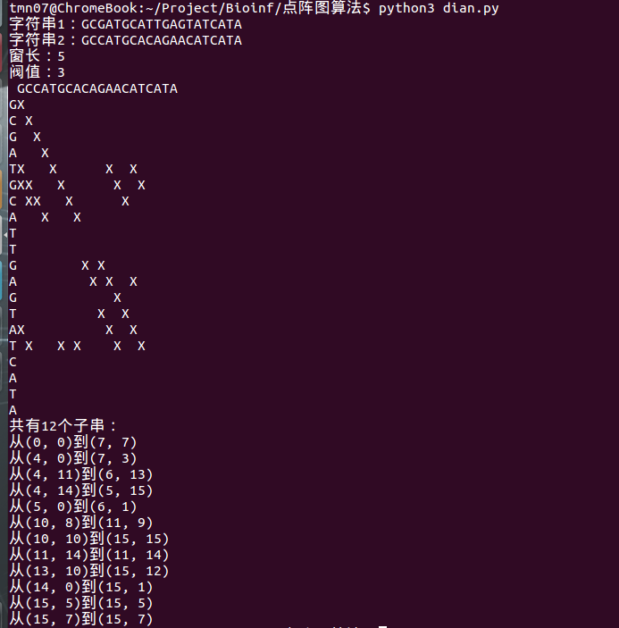
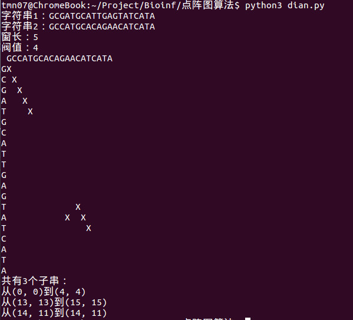
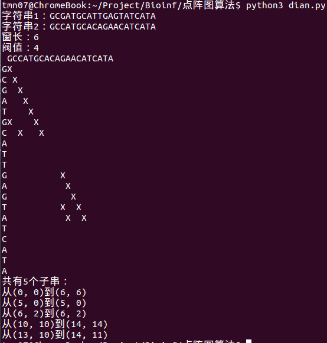

# 点阵图
## 结果



## 代码
dian.py
```python
#coding=utf-8
#python3
from config import *

def match(s1,s2):
	"""
	s1,s1长度一致，有fs对字符一致则认为一致
	"""
	num = 0
	for x in range(0,ws):
		if s1[x]==s2[x]:
			num += 1
		else:
			continue
	if num >= fa:
		return True
	else:
		return False

def print_all():
	"""
	输出点阵图与相关信息
	"""
	print("字符串1："+str1)
	print("字符串2："+str2)
	print("窗长："+str(ws))
	print("阀值："+str(fa))
	print(" "+str2)
	for x in range(n):
		print(str1[x],end="")
		for y in range(m):
			if (x,y) in l1:
				print("X",end="")
			else:
				print(" ",end="")
		print("\n",end="")


def print_sub():
	"""
	输出子串
	"""
	re = []
	arr = []
	for i in l1:
		if i in re:
			continue
		else:
			tmp = [i]
			# print(i,end="")
			x = 1
			while ((i[0]+x,i[1]+x) in l1) and ((i[0]+x,i[1]+x) not in re):
				# print((i[0]+x,i[1]+x),end="")
				re.append((i[0]+x,i[1]+x))
				tmp.append((i[0]+x,i[1]+x))
				x += 1
			# print()
		arr.append(tmp)

	print("共有%d个子串："%len(arr))
	for i in arr:
		print("从"+str(i[0])+"到"+str(i[-1]))

def main():
	for x in range(0,n-ws+1):
		for y in range(0,m-ws+1):
			if match(str1[x:x+ws],str2[y:y+ws]):
				l1.append((x,y))


if __name__ == '__main__':
	l1 = []
	main()
	print_all()
	print_sub()
```

config.py
```python
# 两个串
str1 = "GCGATGCATTGAGTATCATA"
str2 = "GCCATGCACAGAACATCATA"

n = len(str1)
m = len(str2)
# 滑动窗长度
ws = 5
# 需匹配字符长度
fa = 4
```