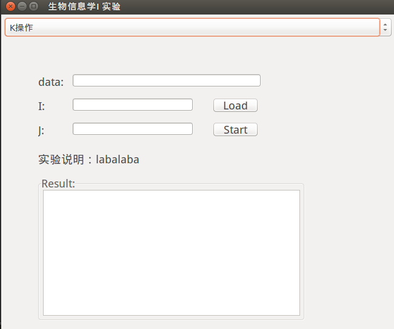
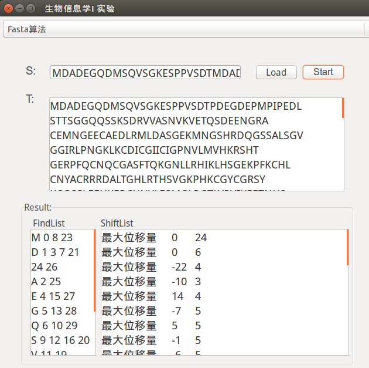

# 生物信息学1

说明：实验是要查的，作业是自己蛮写的，为了偷懒不写伪代码画图什么的。

使用必须用C/C++/Java。让我个天天写脚本语言的人gg了。且要有GUI界面。

作业一般用python写。

## 实验

1. K操作，fasta算法（ok
2. 编辑距离（ok
3. NW，SW算法（ok
4. ID3算法

用VS2013编译通过。。比如说`__min`比较坑。。

GUI使用wxPython，特地写了一篇博文 [wxPython](http://tmn07.com/hexo/2016/11/07/wx) 欢迎来踩

现在还未完成大概长这样

## 作业

1. 点阵图（ok
2. SW（ok
3. 星型比对