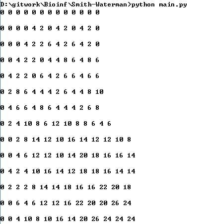

稍微验证了一些，应该没错，除非理解错了~
```python
# coding=utf-8
s1 = "ATGCAGCTGCTT"
s2 = "CGTATAGCTACTG"

m = len(s1) + 1
n = len(s2) + 1

# m*n 记录个状态的值
M = [([0] * (m)) for i in range(n)]
# 用来记录转移的方向
F = [([0] * (m)) for i in range(n)]

def output():
    for i in xrange(0, n):
        for j in xrange(0, m):
            print(M[i][j]),
        print("\n")
    # for i in xrange(0, n):
    #     for j in xrange(0, m):
    #         print(F[i][j]),
    #     print("\n")

def run():
    for i in xrange(1, n):
        for j in xrange(1, m):
            x1 = M[i][j - 1] - 2
            x2 = M[i - 1][j] - 2
            if s1[j - 1] == s2[i - 1]:
                x3 = M[i - 1][j - 1] + 4
            else:
                x3 = M[i - 1][j - 1] - 2
            Status = [0, x1, x2, x3]
            M[i][j] = max(Status)
            F[i][j] = Status.index(max(Status))

if __name__ == "__main__":
    run()
    output()
```

结果：

